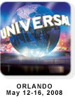

11 April 2008

 VS Live Orlando is coming up soon, and I'll be speaking at the event.

I'm giving a presentation on the use of OO concepts, WCF services and Silverlight working together to build compelling web applications.

And I'm giving a full-day workshop covering a broad range of .NET technologies, focused on transitioning from the .NET 2.0 world forward into the .NET 3.5 world. Not surprisingly, I use CSLA .NET as part of this workshop, though the primary focus is on making sense out of all the different technologies you might use for creating your applications.

As a track chair and speaker for VS Live, I am able to provide you with a special discount code. [Register for VS Live](http://vslive.com/2008/orlando/register.aspx) using the code **SOLHO** and save $300!
