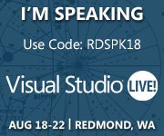

07 June 2014

 I thought you might be interested to know that I’ll be speaking at Visual Studio Live!, August 18-22 in Redmond, WA http://bit.ly/RDSPK18 .  Join us on this special journey to explore topics covering all-things WCF, ALM, Web Development, Data Management, Visual Studio and more!

I’ll be presenting the following sessions:

Leveraging Windows Azure websites
What’s new in WinRT Development

SPECIAL OFFER: As a speaker, I can extend $500 savings on the 5-day package. Register here: [http://bit.ly/RDSPK18Reg\_](http://bit.ly/RDSPK18Reg_) and use code RDSPK18

Learn how you can build better applications at Visual Studio Live! Redmond — bring the development issues that keep you up at night and prepare to leave this event with the answers, guidance and training you need.  Register now: [http://bit.ly/RDSPK18Reg\_](http://bit.ly/RDSPK18Reg_)
