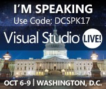

17 June 2014

This is cool – Visual Studio Live! is coming to Washington D.C. this October.

This is the first time the conference has been in D.C. and I’m personally quite excited – not only by the chance to talk to a bunch of enthusiastic technologists from all over the world, but also because I’ll be in D.C. and can take a little time to see some of the monuments and museums.

What a great opportunity!

You can save $400 off the 5 day all-access Best Value Conference Package by [registering here](http://bit.ly/DCSPK17_Reg) with priority code DCSPK17.

As per my previous post, I’ll also be [speaking in Redmond](http://www.lhotka.net/weblog/VSLiveRedmond2014.aspx) this summer. So whether you attend in the summer on the west coast, or the fall on the east coast I look forward to seeing you!
