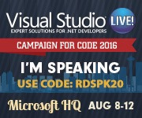

11 June 2016

Now is the time to register for [Visual Studio Live! Redmond 2016](https://vslive.com/events/redmond-2016/home.aspx). Sure, the conference isn’t until early August, but now is the time to get early discounts and all that stuff.

This link gets you one of those discounts: [RDSPK20\_Reg](http://bit.ly/RDSPK20_Reg "RDSPK20_Reg")

This is a great event, right there on the Microsoft campus – often the best of our events in terms of spontaneous opportunities to interact with your favorite Microsoft engineers – and as is the case with all the VS Live events this is the best opportunity to learn about current and future technologies around Microsoft, the web, and mobile app development.

After all my [recent health issues](http://www.lhotka.net/weblog/EasingBackIntoIt.aspx), I’m finally back to doing a workshop. [Jason Bock](https://github.com/jasonbock) and I will be giving a pre-con on distributed computing, including the use of various Azure features, microservices, and of course a little bit of CSLA .NET 

I hope to see you there!
