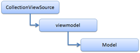

19 February 2010

As noted in a previous post, I’ve been spending some quality time with the new VS10 XAML designer. It is fun, but challenging to figure out how the designer wants everything to work, and to adapt existing CSLA .NET components to work smoothly in the new environment.

Yesterday I spent a substantial amount of time trying to get PropertyStatus, InvokeMethod and Execute to work nicely. These three controls have one thing in common: they all interact *directly with the real data object*. InvokeMethod and Execute both invoke methods on the data object (usually a viewmodel), and PropertyStatus reads property-specific metadata about a property, such as whether the property has any info/warning/error messages that the user should see.

The VS10 designer uses something called a CollectionViewSource as its primary binding target. When you drag-and-drop a type from the Data Sources window onto your form, the designer creates a CVS resource in the form and uses that as the DataContext for your UI elements. In this regard it is not entirely unlike a data provider control in WPF, though it is certainly not a data provider control.

If you are using a viewmodel (and I am), then your DataContext is actually a hierarchy of object instances.

This is made slightly more complex when you realize that the Source property of a CollectionViewSource can only be a list. So really the CVS contains a list of viewmodel objects – but in my case that list has only one item.

InvokeMethod and Execute both need access to the viewmodel – that’s the object containing the methods to be invoked. PropertyStatus actually needs access to the Model (the real business object), because that’s the object where the business properties and associated metadata are actually implemented.

None of this would be that complex, except that the VS10 designer sets the DataContext to the CVS, and then uses currency to make one item in the Source property “current”. But if you, in code, get access to the DataContext for a control you get the CVS. If you get a BindingExpression object for a given binding, the DataItem is the *current item in the CVS*, which turns out to *not be the viewmodel*. Instead the DataItem on a binding is an internal type within .NET.

And this is what had me stuck. The CVS has no CurrentItem property, but this internal type does. However (short of reflection), there’s no way to interact with members of an internal type. What to do? Thanks to help from Mark Boulter I now know that this internal type implements the public ICollectionView interface, and that interface does have a CurrentItem property.

Whew!

What this means is that in InvokeMethod and Execute, I can take the associated UI control (like a Button or something) and use it to find the viewmodel:

> public static object GetTarget(UIElement ctrl)
> {
>   object result = null;
>   result = ctrl.GetValue(TargetProperty);
>   if (result == null)
>   {
>     var fe = ctrl as FrameworkElement;
>     if (fe != null)
>       result = fe.DataContext;
>   }
> **  var icv = result as ICollectionView;
>   if (icv != null)
>     result = icv.CurrentItem;
> **  return result;
> }

This basically takes the DataContext value, sees if it is an ICollectionView, and if so it returns the CurrentItem – which is the real data object, or at least the viewmodel.

PropertyStatus is a little more complex, because it has to trace down to the actual underlying business object, and if so it needs to dereference elements of the property name path. For example, the property name might be Name, or it might be Model.Name. If it is Name, the assumption is that CurrentItem is the actual data object. If it is something like Model.Name, the assumption is that PropertyStatus needs to use the Name property on the object referenced by the Model property. The code actually goes n levels like this, allowing for access deep into hierarchical object graphs.

> private object GetRealSource(object source, string bindingPath)
> {
> **  var icv = source as ICollectionView;
>   if (icv != null)
>     source = icv.CurrentItem;
> **  if (source != null && bindingPath.IndexOf('.') &gt; 0)
>   {
>     var firstProperty = bindingPath.Substring(0, bindingPath.IndexOf('.'));
>     var p = MethodCaller.GetProperty(source.GetType(), firstProperty);
>     return GetRealSource(
>       MethodCaller.GetPropertyValue(source, p),
>       bindingPath.Substring(bindingPath.IndexOf('.') + 1));
>   }
>   else
>     return source;
> }

Again, if the source is an ICollectionView, the code skips right to the CurrentItem property, which is the first “real” object worth using.

I suppose writing controls that interact with the real data object isn’t something people do every day, but if you end up writing such a control hopefully this blog post will help save you some time and frustration.
