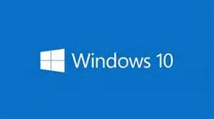
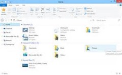
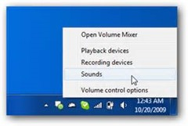

16 February 2015

 Initial thoughts using Windows 10 consumer preview (keeping firmly in mind that there's at least one more preview before release, so everything I'm complimenting and criticizing here will probably change before release).

Perhaps most importantly, **I like where they are going**. I fully adopted Windows 8.1, and enjoy using it - including the start screen as well as apps from the store. I also understand how people don't like it, and prefer a more "Windows 7" experience. I share those views in terms of multi-monitor support and effective use of screen real estate on larger monitors; both are constant frustrations with Win8.

Win10 at this point feels like a pretty decent effort to make 100% keyboard/mouse/Win7 users happy while still making WinRT store apps attractive to them. And at the same time they've done a good job of allowing touch/keyboard/mouse people like myself to continue to be happy. I'm still not entirely sure they've got the pure touch user experience quite right, but they aren't done yet either.

**I really like the new start menu**, particularly the fact that I can set it to be full-screen since that's what I've become used to over the past few years with Win8. I get that some people like the menu view, but I find it cramped and would miss what I think of as my "life's dashboard" view that I get from the start screen. The way they've changed it in Win10 should make us all happy.

I like the fact that I can press the Windows key and just start typing the name of the app I want, just like we've been able to since … Windows Vista? As a bonus this is actually triggering Cortana and that makes me happy!

I **dislike that the Places list **on the start menu appears fixed. In particular, the Documents option is useless because it doesn't go to the Documents library or even OneDrive - it goes to the local Documents folder on the device, where I never store anything (because I use OneDrive). Sadly I can't see how to change this Documents option to point to a location I care about, so it just wastes space.

I'm not sure the **Most Used list **actually works yet. It lists a bunch of apps I almost never use (I don't think I've ever run something called 'Sticky Notes'); but I like the concept once it actually starts working.

** OneDrive has been nerfed **and is nearly useless. They seem to have made it work so only way to see what you actually have is to use a web browser, or to sync everything local. I have a lot of content in OneDrive (pretty much everything) and so I can't sync local to every device because my tablet (for example) doesn't have enough hard drive. This means I need to use the web browser to download individual files or sync entire folders - a major step backward from Windows 8.1.

(I honestly think they just aren't done with OneDrive yet - this is such a major step backward to where we were perhaps 5 years ago that I doubt it is the planned experience.)

**Win8 apps that use the AppBar **are going to need to be rewritten to avoid it. The AppBar is really hard to bring up in touch mode, and apps (like Mail) where you need to use the AppBar to do common tasks are therefore really hard to use. Other apps, like NextGen Reader, that already show many common tasks as icons on their main screen were and are easy to use and probably are the future of modern app design.

You can see this in the new preview Word, Excel, etc. apps too. I'm not even sure if they have an AppBar, but they do have a ribbon that's easily accessible.

The same is true with the charms functions. Particularly **Search, Settings, and Share **need to be on every app's main UI because they are too hard to get to in the new Win10 UI model. Existing apps that have their own search, settings, and share buttons on the main UI seem just fine, but many apps followed Microsoft's (old?) guidance about the charms bar and are pretty hard to use now.

** Search is particularly confusing** now because Win-Q brings up Cortana, never a contextual search for the current app. I actually think that's fine, but I think we do need some standard shortcut key for search in the current app (maybe ctl-F or F3?).

I wish that all apps (especially the browser) could go into a **real full-screen mode **when I'm in tablet mode. I'm not 100% sure why even old Win32 apps couldn't go into a borderless mode at this point. Perhaps there's some technical reason, but if every app could be made borderless full-screen that'd make me happy on my tablet.

When I'm in a full-screen modern app and accidentally open a Win32 app or dialog the result is that the modern app switches back to windowed mode. I guess I'm not entirely sure what should happen in this case, but when I'm in tablet mode I really don't expect or like the idea of my full-screen apps being reduced to windowed mode out from underneath me. That's very jarring.

**The new Notifications area is very nice**. I've started using that very naturally and it just feels good and provides good information. This kind of fits under the "its about time" category of change.

I miss being able to bring up the charms bar to **get the clock**. In fact, I don't see how you can view the date/time when using a full-screen app unless you revert to windowed mode to see the system tray on the desktop. I guess that might be OK, but this change will probably get me to start wearing my watch again because I don't want to have to leave my current context just to see the time.

A colleague pointed out that having the **Windows task bar along the bottom **like it is by default is problematic when using a Surface 3. I've been using a SP2, but he put it on his SP3, and the problem is that the keyboard gets in the way of your finger when you want to tap anything on the task bar. I tried it, and he's right - it is annoying.

People who've never used a touch device probably can't relate, but once you have a touch screen it is so natural to seamlessly switch between touch, keyboard, and mouse for various interactions that I'd never go back. One of the most common reasons for touch is to launch or activate apps, because touch is almost always easier/faster than dragging the mouse around. Perhaps the answer is to put the task bar on the side or top, or perhaps the Surface Pro 4 will need to allow more space between the keyboard and the bottom of the screen to accommodate the increased use of the task bar in normal touch scenarios.

 I'm still not sure what to think about **File Explorer** being the primary way to interact with files via touch. We've all suffered with it over the past few years of Win8, and I've tried a great many touch-based replacements with 'File Manager HD' being my current favorite. I'd rather expected to see a touch-friendly file manager with Win10, but instead what they seem to have done is left us with the Win7-era File Manager, which is fine with mouse or stylus, but can be pretty awkward with touch.

**The new Store app is quite nice**, and I like it quite a bit more than the old version. I'm also very hopeful that allowing WinRT/Universal apps to run in actual windows means people will be more accepting of this type of app. I am shocked at how few Win8 users have ever installed a 'modern app', especially given that some of them are extremely good - and perhaps more importantly they don't come with the same risk of viruses and malware as legacy desktop apps.

 I remain disappointed that the only way to **switch audio input/output devices **is via that ancient and clunky Win32 audio settings window. I often switch between a headset and actual speakers depending on what I'm doing, so I use that crufty dialog almost daily, and it is particularly painful in a touch scenario. This is the same as in Win8, and it sucked there just like it does in Win10.
