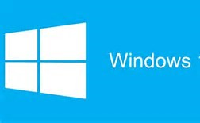
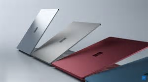

02 May 2017

There seems to be some confusion around what Microsoft announced today around Windows 10 and the Surface Laptop.

These are two separate things.

### Windows 10 S

This is a new flavor of the Windows 10 operating system. It has nothing to do with hardware. Numerous hardware vendors announced Intel-based devices that'll run this flavor of Windows - including Microsoft.

This version of Windows 10 is restricted to running apps deployed from the Windows store. That includes WinRT/UWP apps, *and it includes Win32 apps*. For some time now it has been possible for software developers to deploy Win32/.NET apps via the store - Slack is a good example.

Microsoft has said that they'll soon have the full Win32 version of Office in the store. Which makes sense, since they'll want Windows 10 S users to also use Office.

It is also the case that Windows 10 S is more locked down than standard Windows 10, both from a security and battery life perspective. Lower-level features/tools used by developers aren't available, improving security and battery life by eliminating things you don't want students (or most users) to do anyway.

Can a flavor of Windows survive if it only runs apps deployed from the store? I don't know, but given that it is pretty easy for software developers to deploy *their existing apps* via the store, plus there's quite a lot of nice UWP apps there too, I think it might have a shot.

Personally I wish more software vendors deployed via the store, as that radically reduces the chance that people will get a virus from some random website deploy.

### Surface Laptop

This is a new member of the Surface hardware family. It is a laptop, not a tablet or convertible like the Surface Pro or Surface Book.

This is a nice looking and pretty high end laptop. It has Intel Core i5 or i7 chips, a beautiful touch screen like all the other Surface devices, works with the stylus, and comes with as much as 16gb memory and a 1tb SSD. Microsoft is claiming up to 12 hours battery life.

Personally I really enjoy my Surface Pro 4, and use it as a tablet quite often, so I'm not planning to switch to a laptop. So I'm holding out for a Surface Pro 5 😃

But I understand that a lot of people really like the laptop form factor, and this is like a super-powered Macbook Air with a touch screen and (imo) a better operating system.

Speaking of which, the Surface Laptop will ship with Windows 10 S, and can be upgraded to Windows 10 Pro. So for a lot of "regular users" they'll be able to use it as-is, and for power users or developers we can upgrade to Pro to unlock all the power (though Microsoft warns that this will reduce battery life, because Windows 10 S does a better job in that regard).

### Summary

Hopefully this helps with some of the confusion. This is *not* another Surface RT sort of thing. Nor is it a return to ARM-based hardware.

It is a new flavor of Windows 10 focused on regular computer users, thus providing enhanced security and battery life, with a consistent way of deploying apps.

And it is a new member of the Surface hardware family. A high-end laptop for Windows 10 S or Windows 10 Pro.
