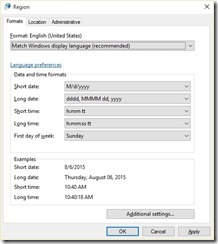
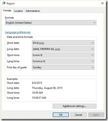

06 August 2015

After last night’s big cumulative update of Windows 10 one of my devices (my primary desktop) had some issues. Specifically, there were 4 apps the store wanted to update, but it seemed unable to download any of them (even after numerous reboots and [running wsreset](http://www.lhotka.net/weblog/FixingWindows10StoreIssues.aspx)). And the Mail/Calendar apps were frozen; they’d launch but freeze.

The solution was in this article: [http://answers.microsoft.com/en-us/insider/forum/insider\_wintp-insider\_store/windows-10-store-beta-problems-wont-update/d7fe3b06-63e1-44c7-a5b0-2b8b6868e16d?auth=1](http://answers.microsoft.com/en-us/insider/forum/insider_wintp-insider_store/windows-10-store-beta-problems-wont-update/d7fe3b06-63e1-44c7-a5b0-2b8b6868e16d?auth=1 "http://answers.microsoft.com/en-us/insider/forum/insider_wintp-insider_store/windows-10-store-beta-problems-wont-update/d7fe3b06-63e1-44c7-a5b0-2b8b6868e16d?auth=1") (followed by a reboot and then re-running wsreset).

My region/format setting in Control Panel (the old Win32 one) was set to the default:

And the fix was to change it to my explicit region:

To easily get to this dialog, press windows-x and select ‘Control Panel’. Then in the search box (upper-right corner) type ‘Region’ and click the one search result to open the dialog shown here. Then reboot.

Why this works I don’t know – clearly something gets confused deep inside Windows – but as long as the problem is solved I’m happy 
