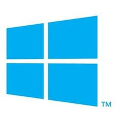

30 May 2014

 I just had an odd thing happen – the Windows Store app (the store itself) crashed and wouldn’t start, even after a reboot. I’d click the tile and the app would show its launch screen with the busy animation. Task manager showed that it was consuming around half my total CPU time.

I found lots of different possible solutions by searching. From the comments it sounds like some of them fix the issue for some people. None of them (even some wacky ones like enabling Hyper-V) worked for me.

The primary solution appears to be running the [Apps troubleshooter](http://windows.microsoft.com/en-US/windows-8/what-troubleshoot-problems-app). And this did find an issue with the store and it reset the store cache (or tried anyway).

I think (though I’m not sure) that this is the same as running the wsreset.exe utility that is supposed to reset the store’s cache and launch the store.

Neither of those solutions worked.

So I thought if the cache was the problem perhaps I should just clear the cache myself. The cache for the store is located at

> %userprofile%\AppData\Local\Packages\winstore\_cw5n1h2txyewy\LocalState\Cache

I opened an admin command window, navigated to the LocalState folder and renamed the Cache folder to CacheX.

Then I ran the store app and it worked fine, including creating a new Cache folder.

Finally I deleted the CacheX folder using the command window

> rmdir /s CacheX

I suspect that the wsreset.exe command was supposed to do this, but it failed. Or perhaps it does something else and failed. In any case, manually eliminating the corrupted cache solved my problem.
