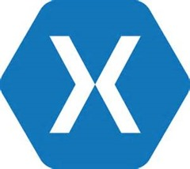

24 February 2016

By now nearly everyone is aware that Microsoft is acquiring Xamarin, and from what I can see nearly everyone is ecstatic!

If you missed it, here are a couple important blog posts:

- [Scott Guthrie](http://weblogs.asp.net/scottgu/welcoming-the-xamarin-team-to-microsoft)
- [Nat Friedman](https://blog.xamarin.com/a-xamarin-microsoft-future)

I am generally positive on this, with the same reservation I’ve had since rumors of this idea came up a couple years ago: Xamarin has been able to navigate and maintain good relationships with Apple and Google (and others) for some years now – releasing support for those platforms concurrent with Apple and Google releasing new versions of those platforms. It may be difficult for Microsoft to maintain comparable relationships with Apple and Google over time, because they aren’t a scrappy startup, they are a peer.

On the upside, what I *hope* comes out of this includes:

First, rolling Xamarin directly into Visual Studio, thus making it part of my existing MSDN subscription. Just think about the consequences if everyone who has an MSDN subscription (so everyone with Visual Studio 2013/2015 today) can all of a sudden build cross-platform .NET apps for Windows, iOS, Android, and OS X – at no additional cost.

One big thing holding Xamarin back in terms of widespread adoption is its cost. At $2k/developer it is prohibitive for a lot of scenarios, and that has been driving people to less productive and robust tools such as Cordova. But if we all get cross-platform .NET as part of our existing MSDN that radically changes the equation – in a way that favors the use of .NET.

Second, enabling Microsoft to provide UWP (XAML and APIs) on iOS, Android, and OS X. The “U” in UWP is “Universal” – and that’d have a *lot* more weight if it meant all the popular smart client development targets available today, not just the Microsoft ones. I imagine such a UWP would replace Xamarin Forms with the same XAML dialect we see on Windows 10 and Windows 10 Mobile, and obviously there’d need to be some serious work in creating WinRT API support (yes, WinRT “2.0” is really what’s underneath UWP) for these other platforms – so we won’t see this overnight – but the long-term implications are amazing.

Microsoft’s biggest single problem, especially on Windows phones, but also on Windows 10, is getting high quality apps that target these platforms. A truly universal UWP might help this problem by making .NET/UWP become the single most cost-effective way to build *any* smart client cross-platform app.

On the whole I am quite happy and excited – congratulations to the Microsoft and Xamarin people who put this together!
