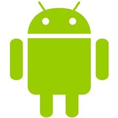

08 April 2016

Earlier today I tweeted that I have an Android phone on order, because I’m frustrated with my iPhone.

Not surprisingly that resulted in people wondering why I’m frustrated.

My iPhone experience started in mid-January when I switched from Windows 10 Mobile to iOS because I was frustrated by the lack of apps on my Windows phone. A couple weeks later I wrote up my [Windows Phone vs iPhone comparison](http://www.lhotka.net/weblog/MyWindowsPhoneVsIPhoneComparison.aspx). After a couple more months of using the iPhone I stand by what I wrote in that post – Windows 10 is far superior to iOS, but the lack of apps on Windows phones is crippling.

But there are some things that really bug me about the iPhone – frustrations I face literally every day. Most notably:

- No live tiles – man do I miss live tiles!
- Cortana on the iPhone is crippled, and Siri is an idiot
- The “back navigation” concept on the iPhone is ridiculously inconsistent and poorly implemented
- The concept of sharing from one app to another is robust on iOS, but is also ridiculously inconsistent and convoluted
- So many things that are simple on Win10Mobile require a *lot* more taps/swipes/effort on iOS

I know that Android won’t solve or address all these issues. Maybe it won’t address any of them, I won’t know until I try it. And I say that based on my experience switching to the iPhone; everybody prioritizes different features and abilities differently, so I find it virtually impossible to get at the “reality” of each OS by talking to other people.

Here’s what I *think* I will find on Android:

- No live tiles – still my number 1 issue with any other phone OS
- Cortana on Android is reputed to be much better than iOS; almost as good as Windows; and the [new Windows 10 Anniversary Edition mobile integration features](http://www.windowscentral.com/windows-10-anniversary-update-features) work with Android as well as Windows 10 Mobile (but not iOS)
- Android has a back button, so I am hopeful the “back navigation” experience will be more consistent than iOS (which is, frankly, a very low bar)
- I don’t know what to expect about inter-app sharing, but I suspect Android is no better than iOS (and let’s be honest, this is also a weak spot for Windows phones)
- I also don’t know that Android will be as optimized for common tasks as Win10, but I can’t imagine it will be more awkward than iOS

At the end of the day though, my three daily frustrations are simple:

1. Live tiles (and the lack thereof)
2. Cortana
3. Consistent navigation patterns (especially the back navigation concept)

Android seems to have a good chance of addressing two of the three, so perhaps I’ll be happier day to day than I am with the iPhone?

I guess time will tell. At least I’ll be able to know first-hand how all three mobile operating systems work for me.
